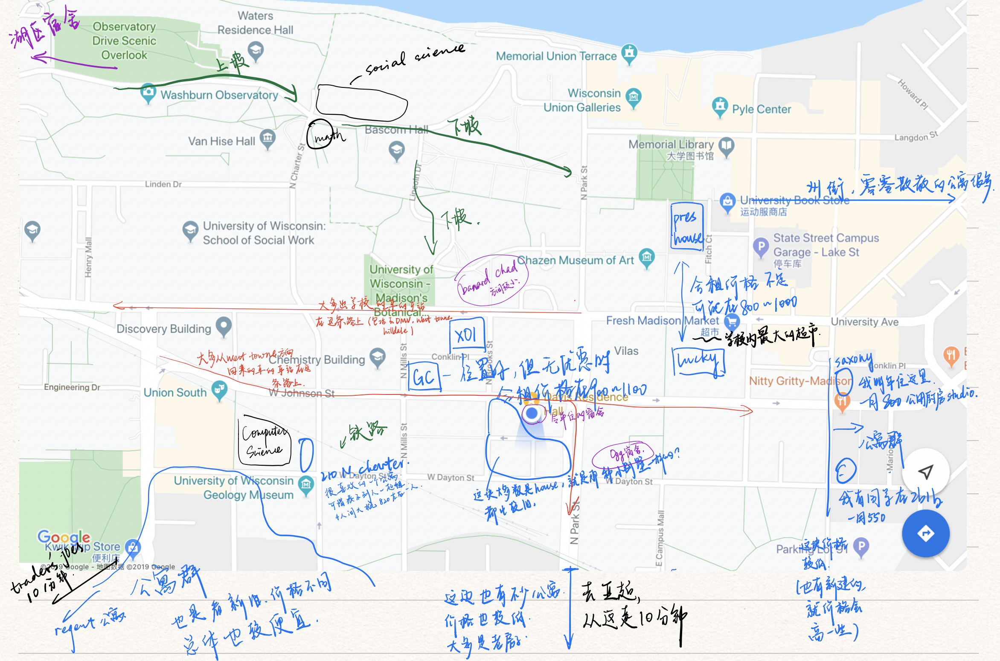

# 好好生活| 租房子那些乱七八糟的事情

终于把所有的期中考完了！开心！想想这连着考的两个月的期中，真的是，窒息。下周就感恩节了！可以放松放松，然后练练路考，希望这学期可以拿到驾照吧嘻嘻。哦还要帮爸妈代购（不过话说回来，感恩节之后过一个礼拜就开始期末了，窒息。。。

Anyway，这篇文章是想说一下上个月折腾明年公寓的琐碎的事情，以及宿舍和公寓的一些对比吧。

大概分了这么几块：大致的时间和流程，价格，宿舍公寓的区别，一些小tips，和我自己的经历这些。这些内容主要针对威斯康星麦迪逊大学和周边的公寓吧，别的区域的情况会或多或少有区别。

要提前说明的是这些内容只是根据我到目前为止的在屯里住宿，找公寓，或者住公寓的经验。所以可能对于其他地区或者学校不是很适用，也可能根据时间而变化。

内容目录
- [时间和流程](#时间和流程)
- [宿舍和公寓的价格与性价比](#宿舍和公寓的价格与性价比)
- [宿舍和公寓的区别](#宿舍和公寓的区别)
- [一些关于查找途径和搬家的tips](#一些关于查找途径和搬家的tips)
- [我自己是如何做决定的](#我自己是如何做决定的)
- [后记更新](#后记更新)

------

## 时间和流程

**宿舍的话老生基本上是前一年十月底开始抢房间**，然后交定金（我去年交了300刀）。新生的话我记得我大一入学之前是五月头抢的房子，会在housing帐号里面有一个固定的时间，开放之后大家一起抢。
可以去**housing的网站**预约dorm tour，但是我没去过，也不确定他们具体是怎么操作的。看房间的话大多都是在学校housing的网站。每个宿舍都有相应的介绍，比如说房间大小，Floor Plan，周边设施这样的。上面也有每个宿舍的3D visual dorm tour，但是应该是要VPN才可以看的。有一点不好的是对于浴室或者厨房这样的公共设施可能图片较少，所以不确定具体如何，最好找住过这个宿舍的朋友问一下。
**租的时间是从8月底到5月考完final之后的第二天**（也可能是第三天）中午十二点（最早在8月15左右可以提前入住，提前的话每天好像要交25刀）**寒假的时候所有的物品都可以放在宿舍里，宿舍也不会断电，但是不能住**，也是要求考完考完final之后的第二天（也可能是第三天）离开，因为你的wiscard这个时间之后就不让你进宿舍了。要住的话要多交400刀的样子。

这边大部分的**公寓或者House（有点类似小的别墅然后房间单独出租或者整栋出租）都是按照8月到8月出租，一半第二年8月开始住的会在前一年的十月头开始签约**。
基本上大部分的公寓在十月初之前会让这一年的住户确认是否续租，如果续租的话继续按照上一年的价格计算（基本上每年房子都会涨），也会给一些比如亚马逊代金券或者洗衣卡这样的礼物（？）
大部分房产商在**10月头**（就是住户确认续租与否的截止日期之后）把空余的房间放到网站上面给有兴趣的人看。好的房子会要抢，比如说Lucky，GC或者X01，虽然可能比较贵，但是抢得特别快（据说Lucky今年还因为抢的人多临时涨价了也是很迷），基本上十月中就已经没有好的房间了。
在知道自己希望住的户型或者具体的房间之后可以和房产商确认时间去看房子（大多数都是在房产商网站上面可以填联络信息，留邮箱，然后等他们回复再确认，也有是直接发邮件给他们确认时间的）很多房产商也会有Open House，就是他们的员工会在特定的时间会在公寓门口等着，然后如果有顾客说要看房子就带他们上去看这种。看好之后如果觉得可以就会去签约，签约的时候会让你交定金，一般在半个月到两个月的房租不等。

还有一点是如果没有在这边有一年或者两年的租房经验的话，公寓可能会要你找一个co-signer（宿舍不用）。有些公寓，比如Saxony是将学校宿舍也算在租房经验内，但是有些公寓不算，就需要额外的租房经验。我有美高的朋友会直接高中时候的住家，也有当地的朋友直接找父母，或者到了大二可以找找大一住公寓的朋友。但是对于大一过来直接住公寓会有点麻烦，我也不知道如何解决。

------

## 宿舍和公寓的价格与性价比

宿舍的话一学年是8500-11000不等，看具体住什么样的房间。我今年住的是Susam B. Davis，是挺大的单人间，价格是9600一学年（八个半月）。我会按照12个月来算。因为我想的是我暑假不在屯里，而且对我来说租公寓的话也不太可能转租，所以就按照12个月来算了。
宿舍还有一点就是住宿舍的学生在食堂里面零售的食物是8折，食堂烧的是7折。如果是感觉自己不太会做饭，要依靠食堂的话是挺划算的。（还有就是这学期Rheta 开始做自助餐，住宿舍的晚饭就5块5，但是不住的话要十块还是十块五）
今年暑假宿舍提供仓库，可以给我们放东西的，但是明年就不给了（这还是我和我的House Fellow聊天的时候才知道的，然后我发了邮件去问发现是真的，感谢House Fellow！）
这也是我明年不再接着住宿舍的原因之一，有一种原先宿舍刚好卡在接受范围之内，但是暑假不让放东西这一点就让我感觉它掉出了接受范围。

公寓的话其实看具体住哪里。因为我不会买车，也考虑到这边冬天巴士出行很不方便，所以对于公寓的选择范围就局限在学校周围。那么价格的话就在800到1300左右一个月（看具体住什么房型了）。大概是底下这个图里面的样子。

性价比的话我觉得看每个人自己需要什么。比如说如果在天天去CS楼的就会觉得那边周围一些公寓近还便宜，就性价比超级高，但是如果学音乐或者艺术的就会选择东边的一些公寓各或者宿舍。

还有就是看自己做不做饭，依赖食堂的话可能会偏向宿舍一些。但是自己做饭的话，食堂有些利大于弊？因为食堂的价格还是比自己做饭来的高，但是新生第一年住宿舍会强制性买Meal Plan，去年就是往帐号里面打1400，2100或者3100刀，打的多有优惠，比如说3100的可以免费喝饮料。这个帐号在食堂和两个Union的餐厅都可以用。不住宿舍了帐号可以继续用，就是没有折扣，但是我不确定毕业了还没用完可不可以退（我去年不知道哪里来的信心觉得我可以在在食堂吃完2100刀，我的饭卡账户在我这学期努力去食堂吃饭之后还剩下九百出头）

可能一些人住宿舍的原因是为了交朋友？但是我感觉会因人而异，也根据宿舍情况会有不同。我大一的时候在Adams，因为是一个learning community，所以活动相比起别的宿舍会多一些，和别人接触也会多一些。我会觉得我到现在为止在屯里碰到的关系比较好的朋友都是大一宿舍或者上课的时候交到的。但是到大二的时候，一个是宿舍比较小，一个我也没有去和别人聊天的想法，所以这大半年住宿对我的交友圈没有什么帮助吧。确实住宿舍相比起公寓会给你一些机会去认识更多的人，但是要不要打交道还是全看自己。同时，住公寓的话，如果是喜欢和别人打交道的人，在上课的时候同样也会交到不少的朋友。所以到底宿舍对交友圈有没有帮助还是因人而异的。

------

## 宿舍和公寓的区别

价格之外，比较基本的区别是宿舍总归有一些规矩要遵守，但对于公寓来说少很多；以及宿舍的公共区域（浴室、厨房等）有人打扫，还有不少共用的打扫工具和厨房用具，而公寓没有。

规矩这一方面，屯里宿舍的规矩比国内宿舍的不知道少多少了，但是总归是有的。我觉得有两点比较突出，别的都挺琐碎的。
一个是宿舍的**Quiet Hour**，就是在固定的时间段要保持安静，不是完全无声音，而只是不打扰邻居（不过宿舍的隔音大多都不太好。。。）具体时间的话，每个宿舍都不一样，但是大多上在周日到周四23：00 - 7：00和周五周六的凌晨到8：00左右；然后整个期末周的时间都是属于Quiet Hour之内的。
这个规定有利有弊吧。好的方面是大多情况下不用担心隔壁邻居在不该扰民给的时候扰民。（听说有住宿舍的学生不按规矩行事，但是我没碰上过）不好的是有些情况下还是想在Quiet Hour 发点声音的。比如说晚上洗头晚了要吹头发（这个如果不经常这样做的话邻居也能理解，但总是不太好意思）或者考试周心情烦躁想玩玩吉他等等。
住公寓的话，如果不是单人间也需要考虑一下这种约定，但总归是可以和室友协商的。

还有一个规矩是在一些特定时间段，比如说万圣节，感恩节，考试周，**对来访人员有限制**。我记得我住的两个宿舍都规定说万圣节的时候不能有不是学校宿舍住户的来客（应该是为了安全），感恩节和考试周不能有人在宿舍过夜（虽然说不被发现也没啥事）。
公寓的话就只要和室友约定好，就没什么事。

**公共区域打扫**这一块，我觉得学校宿舍做得挺好的。我印象中的是，除了感恩节，每天都有人来打扫公共区域，包括洗衣机和烘干机好像也会消毒。这样就不用很担心共用一个浴室或者厨房的同学弄脏公共区域却不打扫这种情况（当然这不是自己用完后不清理的理由）。

还有就是如果有遇上把公共区域弄得很脏缺不清理的人，和house fellow说了之后，他们会去找这些人聊（算是起一个监督的作用吧）至少我住的两个宿舍的公共区域都一直挺干净的。
但是公寓的话，如果涉及公用区域，正好不幸碰上一个不喜欢打扫的室友，就有点惨了。
最后一点是宿舍提供不少**工具可以共用**的。比如说打扫房间的各种工具都有，只要确保用完之后清理干净再放回原处就行。还有卫生间的厕纸、洗手液、垃圾袋这种都有，也可以自己拿来用。厨房里面基本的用具也有，比如锅碗瓢盆，吐丝机，微波炉，刀，砧板等等（今年住的宿舍还有榨汁机）。只要不嫌弃公用的，都可以随便用。

------

## 一些关于查找途径和搬家的tips

查找信息的话学校宿舍就是**housing的官网**[https://www.housing.wisc.edu](https://www.housing.wisc.edu/) 
公寓和House的话，我是偏向对于地理位置查找的，所以我用过Abodo或者类似的租房信息网站上面看整个区域都有哪些公寓或者Houses，或者谷歌直接搜目标位置的房源也行。其实有很多这样的网站但是我会觉得abodo是比较完整的一个。它上面还会有一些公寓的visual tour，然后找到感兴趣的公寓之后就可以去搜公寓的官网找具体信息。
这个过程中可能需要VPN。如果还没到屯里但是有学校邮箱或者帐号的话，可以用学校的vpn，信息在[WiscVPN - Overview](https://kb.wisc.edu/page.php?id=90370)

搬家的话学校宿舍和很多公寓都可以费借小推车，其实就是个带着轮子的大框。我去年从湖区搬到东南就是这样搬的。其实挺累，毕竟来回跑了三次，但是至少是可操作的。
我感觉更好的是考了驾照然后租个车搬家会轻松很多，我上学期也是这么想的，可是上学期末了连permit都没有。

------

## 我自己是如何做决定的

我排除了宿舍一个是因为之前说的它**暑假不提供仓库**了。我就想反正我都要找同学存我的东西，那么不如找公寓吧。
第二点是我挺喜欢自己**烧饭**的，毕竟食堂有些单调、不好吃、蔬菜比较少，而且比起自己烧贵了不少，性价比不高。宿舍的话烧饭很麻烦，因为厨房在地下一层，但是我房间在3楼，所以我这两年都是靠着电煮锅，电饭煲，或者instant pot烧饭的。
还有就是**公共浴室**的问题。宿舍好的一点是每天都有人来帮你打扫公共区域，也提供卫生纸之类的。但是会有一些麻烦，毕竟每次去浴室洗漱都要带一堆东西去。而且价格差不多的话拥有自己的浴室不是更好麻？
最后是我觉得我可能明年暑假会留在屯里找教授做研究和考GRE这样的，住公寓的话就方便了很多，不用再找续租（或者搬去学校提供的在湖区的宿舍）。

我自己签房子的过程挺曲折的umm。这次折腾了好久之后，确定了明年去住Saxony（后来又改了，看后记）我会考虑的几点是地理位置，公寓状况，价格，和室友。

因为麦迪逊这边的直饮水硬度很高（用过滤壶都没啥用的那种），所以有条件了之后我每周都会去Fresh 打两三次水（就是重复利用水桶，然后一加仑是45分，去年还39的）虽然在Union South、工院那边也有一个超市，但是它并不能打水，只有接近两刀一加仑的那种。所以我排除了Union South、工院那边的公寓。
而且我会自己做饭，所以是**每周会去一次Trader Joe's 和亚超**。并且我上课的话大多都在West Johnson（是图中靠下的一条描红线的街）的psychology或者zoology（CS的学子因为CS楼没有大教室天天流浪在外）和坡顶的Social Science，Math或者North Charter这条上坡的路边上的楼。所以我一般都在这两条街周围。我就排除了州街上面的一些公寓，偏向图片右下角的公寓群和CS楼边上的210 N. Charter。

公寓状况的话图片右下角离学校最近的大部分公寓都偏旧，虽然价格也便宜，但是我会觉得没有那么有必要。（还是最好约一下看房子去确认公寓的状态在不在接受范围之内）所以右下角最靠近学校的一排公寓里面我偏向Saxony。

价格的话我觉得还有一点要考虑的是，房产商给定的**租金里面到底包括了哪些内容**。这边有一些是所有的水电煤网都包括的（比如GC，X01）。大多是包括除了电或者网之外的所有，那么这样的话，在考虑租金的时候要再加个25-75刀左右（电费还需要问一下需不需要承担服务费，因为服务费占大头，比如电费可能就10刀，但是类似供电的服务费可能要20刀）。还有一些不包括的更多，就计算价格的时候要考虑更多。我会觉得最重要的是**暖气**，因为这边大多都是暖气供暖（小部分是空调）而且暖气其实花费挺大的，毕竟冬天冷，如果不包括的话可能要多付不少钱。

**室友**的话我觉得也挺重要的（不管是和你住一间还是只是和你住一个公寓但不在一间的），我也有一些朋友因为室友的关系出了各种问题。所以我再选房子的时候挺关注室友的。本来看到GC和X01右不错的房型，但是因为凑不到室友，也不想冒风险先签再找室友，所以最后就没去那边。

到最后我是筛选到Saxony的单人间加共用厨房和210 North Charter的四人间的。但是210那边本来有意象一起住的朋友最后还是没有决定住那边，所以我就去Saxony了。我会觉得Saxony这个房型挺不错，（除了它朝西）是不包括电每月805，有自己的浴室，和别人共用厨房的。关键是签房子的时候正好签到和我朋友共用厨房的一间，就很开心，也不用担心万一和共用厨房的人有冲突了。
我会觉得这样的房型比Studio好一些，因为我现在住宿舍用instant pot（10月份新入的！超好用！强行安利！电饭煲已经被我丢床底了）基本上是水煮一切（也可以起点小油锅），但是煮完之后房间里也会有味道。虽然我能接受这个味道，而且通一会儿风就好，但是能不要有不是更好麻。Studio的话就是厨房和卧室在一起，那么有了厨房要起油锅的话，味道肯定会更大。我担心可能会接受不了。

（其实最开始的时候有一个朋友问我要不要一起和她明年去住GC，是一千不到一点一个月的3b2b单人间，我因为想着210 North Charter就有点犹豫，然后就错过了，但是后来想想也觉得还行，毕竟位置是真的好，自带健身房，而且感觉要一起住的朋友都特不错。这个故事告诉我们，**犹豫就会败北！**） 

## 后记更新
因为疫情的关系所以很多2020秋季的大多课依然线上了，所以在家的时间多了很多。于是我从Saxony换到了另外一个旧一些但是是1b1b的公寓，价格的话算上水电网应该是九百刀不到，但是空间大了很多。当时是有点嫌弃公寓太旧，但是看下来还行，不过可惜签的时候没有了朝南的房间，签了朝北的，真的是不好的朝向，叹气，果然犹豫就会败北。可能当时可能还是没有把所有事情都想周到，还是有点急了。

然后我经历的换房子的过程是说签合同之后，我们不能直接毁约，只能把房子转租出去，这可能也是为什么说每年这个时候都要好多全年转租出现？Saxony是要求付200刀的转租费用，但是会把当时的定金还给你。我当时想的是说毁约然后定金就没有了，但其实还拿回来了点。时间的话是五月左右开始转租，前前后后花了大半个月吧。

------

啊，终于把，拖了一个月的文章，写完了！！！！开心！
感觉到了冬天麦屯慢慢变得冷清了，但是也挺喜欢这个安静的屯屯。

